# 一.基本命令

## 1.路径操作

1. `cd 路径`更换目录，`..`表示上一级目录，`/`表示根目录
2. `ls`显示当前目录的所有文件
3. `cp 旧路径 新路径`拷贝文件

## 2.`vi/vim`文本操作

### 2.1一般模式

1. `vim 文件名`进入一般模式

2. 块操作

    - `yy`复制，默认为行。`y2y`复制2行

    - `p`粘贴

    - `u`撤销

    - `dd`删除，默认删除行。`d3d`删除3行

    - `x`剪切，类似于delete。`X`剪切，类似于退格键。

3. 跳转操作

    - `w`，单词操作，跳转到下一个单词。
    - `b`，单词操作，跳转到上一个单词。
    - `^`跳转到行头
    - `$`跳转到行尾
    - `gg`跳转到文本头
    - `G`跳转到文本尾，`3G`跳转到第三行。

4. 修改操作

    - `r`修改当前字母
    - `R`类似于insert模式

### 2.2编辑模式

1. `i`进入编辑器，在当前光标前插入
2. `a`进入编辑器，在当前光标前插后
3. `o`进入编辑器，在当前光标的下一行插入空行

### 2.3指令模式

1. `:`进入指令模式

2. 保存操作

    - `w`写入并保存
- `q`退出
    - `!`强制操作

3. 查找操作

    - `/ 查找词`，查找。`n`跳转到下一个匹配结果。`N`上一个查找结果。

4. 显示设置

    - `:noh`取消高亮
    - `:set nu`显示行号，`:set nonu`取消显示行号。

5. 替换操作

    - `:%s/old/new/g`将old替换为new。其中%表示所有行，g表示行的所有词

6. 所有命令

    

## 3.网络操作

### 3.1初始查询

- `ping ip地址`测试主机能否通信
- `ifconfig`查询自己的网络配置

### 3.2网络基础知识

- 外网`ip`唯一识别路由器，路由器再分配内网`ip`

- 虚拟网络编辑器：类似与路由器（地址转换并连接外部网络）或者交换机。`eg:192.168.65.0`

    自动分配地址范围：`192.168.65.128-254`

- 虚拟网络关系:

    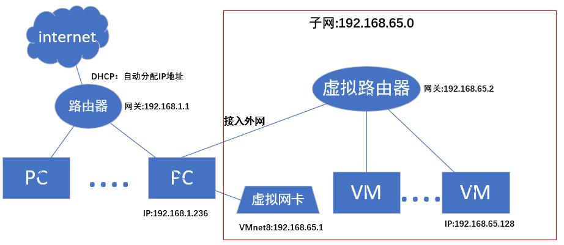

### 3.3网络设置

1. 设置为静态`IP`地址。`vim /etc/sysconfig/network-scripts/ifcfg-eth0`：网络配置文件夹,

    - 将`BOOTPROTO`设置为`static`

    - 在文件末尾添加网络文件配置
        ```
        #IP地址
        IPADDR=192.168.65.128
        #网关：即路由器的地址
        GATEWAY=192.168.65.2
        #域名解析器
        DNS1=192.168.65.2
        ```

    - 重启网络服务：`service network restart`
    
    - 关于查询为`eth1`而文件为`eth0`，参考文章：`https://blog.csdn.net/zaqzaqzaqzzz/article/details/105765071?ops_request_misc=&request_id=&biz_id=102&utm_term=redcat%E7%9A%84eth1%E8%B7%AF%E5%BE%84&utm_medium=distribute.pc_search_result.none-task-blog-2~all~sobaiduweb~default-0-105765071.142^v9^pc_search_result_control_group,157^v4^control&spm=1018.2226.3001.4187`
    
2. 网络主机名

    - `hostname`查询主机名
    - 方式一：修改`vim /etc/hostname`文件，并重启电脑
    - 方式二：百度查询语句
    - 在Linux：`/etc/hosts`文件中添加`ip和主机名`键值对
    - 在windows：`"C:\Windows\System32\drivers\etc\hosts"`文件中添加`ip和主机名`键值对

### 3.4远程登录

1. 方式一（windows命令行）：`ssh 用户名@主机名`
2. 方式二（`Xshell`登录）

## 4.系统管理

### 4.1服务管理

1. 查看所有服务`/usr/sbin`，系统服务即守护进程。

2. `CentOS6`之前的服务：

    - 基本语法：`service 服务名 start|stop|restart|status`
    - 查看守护进程：`ls /etc/init.d/`

3. `CentOS7`的系统服务

    - 基本语法：`systemctl start||stop|restart|status 服务名`
    - 查看守护进程：`ls /usr/lib/systemd/system`/

### 4.2服务的开机自启动

1. `setup`图形化界面：`service`中带*表示开启自启动，空格切换。

2.  系统的运行级别，常用的是**3和5**
    - 运行级别0：系统停机状态，系统默认运行级别不能设为0，否则不能正常启动
    
    - 运行级别1：单用户工作状态，root权限，用于系统维护，禁止远程登陆
    
    - 运行级别2：多用户状态（没有NFS），不支持网络
    
    - 运行级别3：完全的多用户状态（有NFS），登陆后进入控制台命令行模式
    
    - 运行级别4：系统未使用，保留
    
    - 运行级别5：`X11`控制台，登陆后进入图形GUI模式
    
    - 运行级别6：系统正常关闭并重启，默认运行级别不能设为6，否则不能正常启动
    
        `CentOS7`简化版本：`multi-user.target`: 3和`graphical.target`: 5
    
3.  查看和设置当前系统的运行级别

    - `CentOS6`：查看和设置默认`vim /etc/inittab`
    - `CentOS7`：查看`systemctl get-default`。设置默认`systemctl set-default 运行级别名称`
    - 直接设置当前级别：`init 数字级别`

4.  查看进程的开机自启动情况

    - `CentOS6`：`chkconfig --list`
        - 关闭打开：`chkconfig [--level 3] 服务名 on|off`。例如防火墙`iptables`
    - `CentOS7`：`systemctl list-unit-files`
        - 关闭打开：`systemctl enable|disable 服务名`。例如防火墙`firewalld`

5.  关机重启命令

    - 关机：`shutdown` 或者 `shoutdown now|数字分钟延迟|时间`
    - 休眠（不能唤醒）：`halt`
    - 断电：`poweroff`
    - 重启：`reboot`

# 二.命令实操`/usr/bin|sbin`

## 1.帮助命令

1. **`man [-f] 命令名称`：获取帮助文档**
2. `type 命令名称`：查看命令是否是内部命令
3. `help 命令名称`：简化版的`man`，只能查看内部命令。
4. **`命令名称 --help `：外部命令内置帮助文档**

## 2.文件目录类

### 2.1路径

1. `pwd`显示当前链接路径。
    - “-P”**显示实际的绝对路径。**
2. `cd`切换路径。
    - “-”表示刚刚的目录。
    - 空值表示回到主文件夹。
3. `ls`显示文件列表。
    - “-a”显示所有文件，包括隐藏。
    - “-l”显示文件的详细信息，简写为`ll`。

### 2.2文件夹操作

1. `mkdir 文件夹名` 创建文件夹。`rmdir 文件夹名`移除文件夹。
    - "-p"创建父目录。

### 2.3文件操作

1. `touch`创建空文件
2. `cp [选项] 旧 新`：复制或者覆盖文件或者文件夹。

    - “-r”递归操作。
3. `rm [选项] 文件或者文件夹`：删除文件或者文件夹。

    - “-r”递归
    - “-f”强制删除，不提示。
    - “-v”显示过程。
4. `mv`移动文件或目录。妙用：重命名。
5. `cat`查看文件内容。
- “-n”显示行号。
6. `more`文件内容查看器。
    - “=”显示行号。
    - “:f”显示文件名和行号。
    - “enter”下一行
    - “q”离开
7. `less`：类似`more`，但是动态加载内容。

    - “/内容”：关键字查找
8. `echo [选项] “内容”`：控制台输出。

    - “-e”：转义字符串。
9. `>`覆盖重定向。`>>`追加重定向。
10. `head`或者`tail`查看头尾，默认10行。
    - “-n 数字”表示显示几行。
    - “-f”监控文件变化。
11. 软链接。类似快捷方式。
     - 创建`ln -s [源文件] [链接名字]`
     - 删除`rm`，只删除链接，源文件还在。若链接后加“/”，则删除源文件内的东西。
     - 若不加“-s”，硬链接，相当于引用。
12. `history`显示历史命令。

## 3.时间日期类

1. `date +[格式]`查询当前日期。
    - %Y年，%m月，%d天，%H时，%M分，%S秒，
    - %s时间戳。
2. `date -s "时间"`设置当前时间。
3. `cal [选项]`显示当月信息。
    - “-y|年份”显示当年日历。

## 4.用户管理类

### 4.1添加用户

1. `useradd 用户名`：添加一个用户
2. `useradd -d [用户主文件夹] 用户名`：添加一个用户，重命名主文件夹

### 4.2修改密码

1. `passwd 用户名`修改密码

### 4.3查看当前用户

1. `cat /etc/passwd`，root在段首，其他用户在段尾

### 4.4切换用户

1. `su 用户名`切换用户
2. `exit`返回上一个用户
3. `who am i`我是谁
4. `whoami`我在哪里

### 4.5权限管理：临时管理员权限

1. root用户配置`/etc/sudoers` 添加需要赋权的用户
2. 在执行的语句前加`sudo`
3. **`usermod -g 组名 用户名`：修改用户的组名**

### 4.6删除用户

1. `userdel 用户名`：删除用户，但保留文件夹
    - `-r`：同时删除文件夹，但不建议。

### 4.7用户组管理

1. `cat /etc/group`查看用户组
2. `groupadd 组名`**创建组**
3. `groupmod -n 新组名 旧组名`：修改组名
4. `groupdel`删除组

## 5.文件权限类

1. `ll`查看文件权限

    

2. 文件属性

    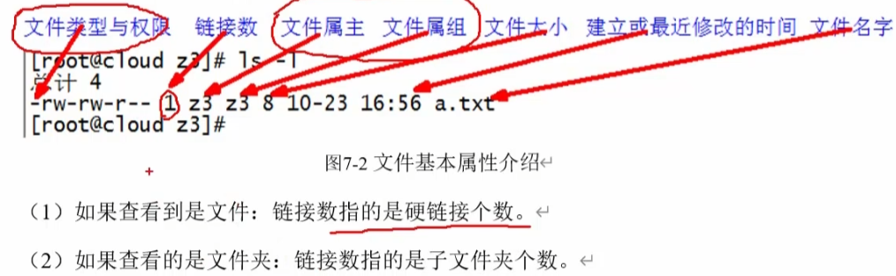

3. 修改权限

    - 方式一：`chmod [{ugoa}{+-=}{rwx}] [文件]`。例如：`chmod g=rw 文件`
    - 方式二：`chmod [mode=421] [文件]`。例如：`chmod 777 文件`
    - `-R`递归设置权限

4. 修改文件所属用户

    - `chown [-R] [最终用户] [文件]`

5. 修改文件所属组

    - `chgrp [-R] [最终用户] [文件]`

## 6.搜索查找类

1. `find [搜索范围] [选项]`：
    - `-name` ：可以使用通配符。如`“*.cfg”`
    - `-user`：
    - `-size`：文件大小。例如：`“+10M”`
2. `locate`：利用数据库索引查找
    - 优点：查找快
    - 问题：不是实时更新。查找前需要执行`updatedb`，更新数据库索引
3. `which [命令]`查找命令文件夹
4. `grep [-n显示行号] [查找内容] [文件]`查找文件内部内容
5. `|`管道操作符。用于筛选结果。
6. `wc`统计单词数量。【行数，词数，字符数】。

## 7.压缩解压类

1. `gzip和gunzip`

    - 压缩类型为`*.gz`
    - 只能压缩文件，不能压缩目录
    - 不保留源文件。

2. `zip [-r递归压缩] 文件 [压缩之后的路径] 和 unzip [-d路径] [文件]`

    - 可以处理目录
    - 可以压缩多个文件
    - 保留源文件

3. `tar [选项] [XXX.tar.gz]`打包归档

    - 选项说明

        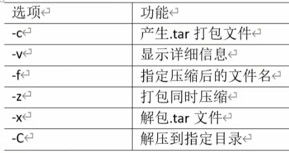

    - 例如：打包`-zcvf 文件名`。解包`-zxvf 文件 -C 解压路径`

## 8.磁盘管理类

1. `ls -lh`查看当前文件空间

2. `du [选项] [目录]`

    - `--max-depth=1`显示的统计层数。
    - `-a`：显示所有，包括子文件夹。或者，`-s`：只显示总和。

3. `df [-h]`空余磁盘

    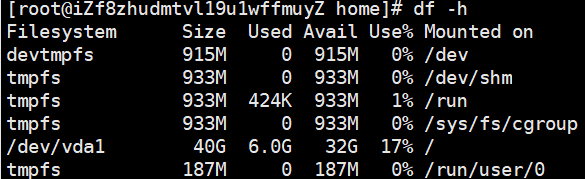

4. `free -h`查看内存使用情况

   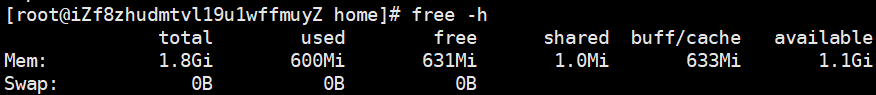

5. `lsblk`显示挂载点详细信息

    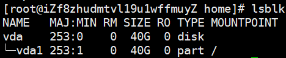

6. 挂载/卸载光驱

    - `mount 硬件 目录`：挂载

    - `umount 目录或者硬件`：卸载

    - 设置开机自动挂载：`vim /etc/fstab`

        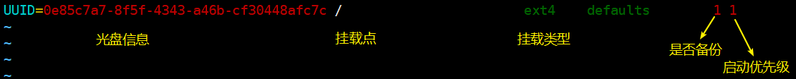

7. 硬盘分区

   - `fdisk -l`：查看硬盘分区
   - `fdsik [硬盘设备名“/dev/sd...|”]`：硬盘分区。按照提示操作。
   - `mkfs -t [文件系统类型xfs] [磁盘路径/dev/...]`：格式化磁盘，使得系统能够识别。
   - 修改挂载点：上6所示。

## 9.进程管理类

   1.  系统服务：参考系统管理。

   2. `ps [选项aux|-ef] [|grep ...]`：查看进程。

       - “a”：列出带有终端的**所有用户进程**
       - “x”：列出当前用户的所有进程，包括**没有终端的进程**
       - “u”：面向用户友好的显示风格
       - “-e”：列出所有进程
       - “-u”：列出某个用户关联的所有进程
       - “-f” ：显示完整格式的进程列表

       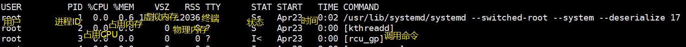

   3. 终止进程:

       - `kill [强制执行-9] [进程号PID]`：杀死单个进程
       - `killall [进程名称，支持通配符]`，谨慎使用。
       - 有用的例子：
           - `kill [ssh对应的进程号]`，杀死ssh连接
           - `kill [bash对应的进程号]`，杀死窗口

   4. 查看进程树：`pstree`

       - 安装：`yum install pstree`
       - 查看：`pstree [-p显示pid，-u显示用户]`

   5. 实时监控进程：`top` [选项]

       - `-d 秒`：设置刷新时间
       - `-p 进程pid`：监控某一个进程


## 10.网络管理

1. `ifconfig`：
2. `ping`：
3. `netstat [选项-anp|-nlp] | grep [进程号|端口号]`：
    - `-a`：显示所有正在监听和未监听的套接字
    - `-n：拒绝别民，显示数字`
    - `-l：仅列出在监听的服务状态`
    - `-p：显示调用的进程`

## 11.定时任务

1. 查看是否启动：`systemctl status crond`

2. 命令：`crontab`

    - `-l`：查询所有定时任务

    - `-e`：编辑任务

    - `-r`：删除任务

    - 格式：

        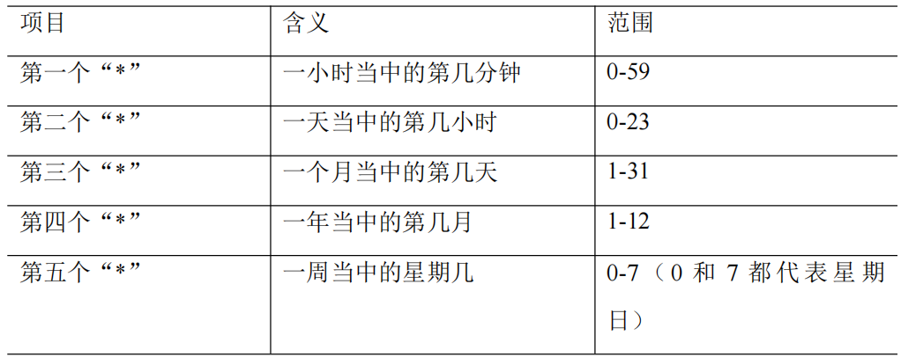

        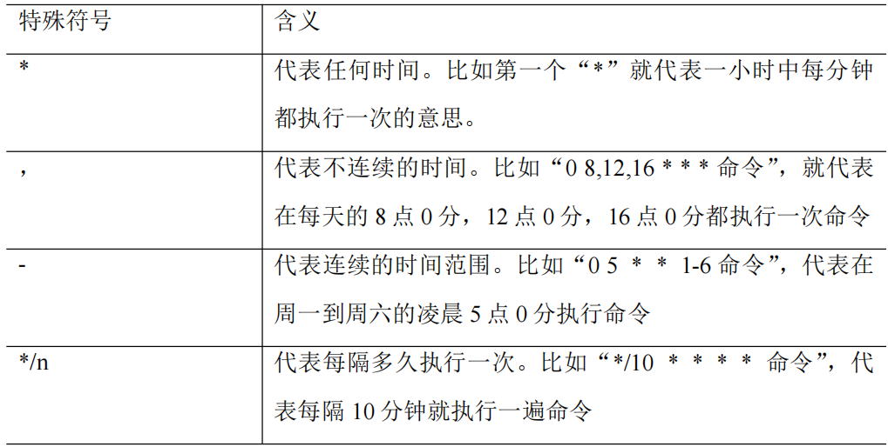

        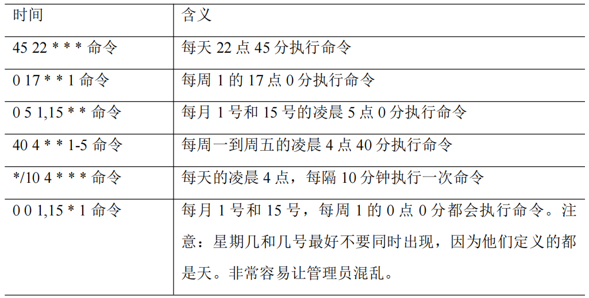

## 12.软件安装

### 12.1`RPM`安装包-不推荐

1. 查询所有的安装包：`rpm -qa`。
2. 查询软件的详细信息：`rpm -qi mysql-community-server`
3. 卸载软件：`rpm [选项：-e|-nodeps直接卸载，不考虑依赖关系] 软件包名字`
4. 安装软件：`rpm -ivh 软件包全名`

### 12.2`YUM`安装-推荐

1. `yum [-y安装中全回答yes] [参数]`

    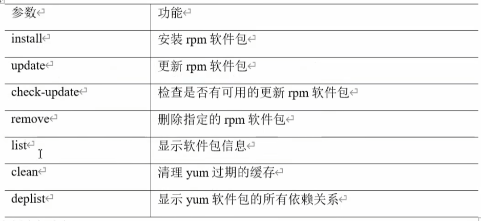

2. 修改镜像文件源：配置文件`/etc/yum.repos.d`

    1. 安装 `wget`, 用来从指定的 URL 下载文件

        `[root@hadoop101 ~] yum install wget`

    2. 在`/etc/yum.repos.d/`目录下，备份默认的 `repos` 文件,

        ```shell
        [root@hadoop101 yum.repos.d] pwd 
        /etc/yum.repos.d 
        [root@hadoop101 yum.repos.d] cp CentOS-Base.repo CentOS-Base.repo.backup
        ```

    3. 下载网易 163 或者是 `aliyun` 的 repos 文件,任选其一，如图 8-2
    
        ```shell
        [root@hadoop101 yum.repos.d] wget http://mirrors.aliyun.com/repo/Centos-7.repo //阿里云 [root@hadoop101 yum.repos.d] wget http://mirrors.163.com/.help/CentOS7-Base-163.repo //网易 163
        ```

    4. 使用下载好的 `repos` 文件替换默认的 `repos` 文件
    
        ```shell
        [root@hadoop101 yum.repos.d] mv CentOS7-Base-163.repo CentOS-Base.repo
        ```

    5. 清理旧缓存数据，缓存新数据
    
        ```shell
        [root@hadoop101 yum.repos.d]#yum clean all [root@hadoop101 yum.repos.d]#yum makecache
        ```

    6. 测试
    
        ```shell
        [root@hadoop101 yum.repos.d]# yum list | grep firefox [root@hadoop101 ~]#yum -y install firefox
        ```

    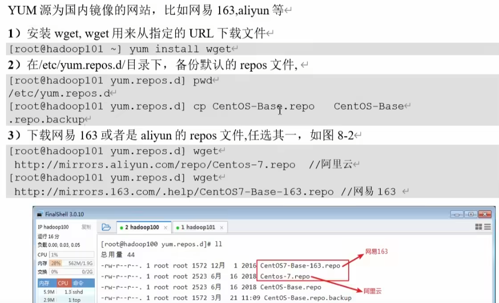
    
    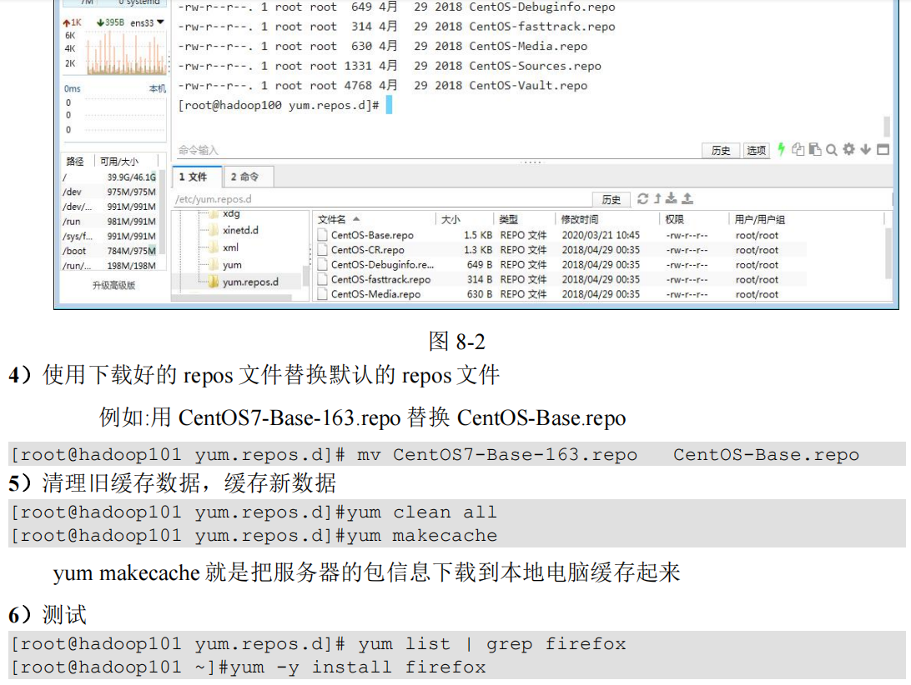

# 三.`shell`编程

## 1.文件格式

1. 文件可以随便命名，但一般建议用`.sh`结尾
2. 首行指定解析器：`!/bin/sh`
3. 注意
    - 赋值的“=”前后不能有空格。
    - 

## 2.编写脚本

### 2.1变量

#### 2.1.1基本变量

1. 查看变量：`echo $HOME,$PWD,$USER,$SHELL`
2. 查看系统定义的所有**全局**变量：`env | less`。查看**系统和用户**的所有变量`set`
3. 用户定义的变量默认为局部变量，使用`export 变量`可以升级为全局变量。
4. 只读变量：`readonly`。不能使用`unset`撤销
5. 撤销变量，释放内存：`unset 变量`

#### 2.1.2特殊变量

1. 系统环境变量：`$PATH`
1. `$n`位置变量，代表第n个参数
1. 单引号为纯字符，双引号内部可以被解释。
1. 获取当前文件的名称（不包含路径）：`basename`，后文再介绍
1. 统计所有参数的个数：`$#`
1. 获取所有参数：`$*`用于查看参数，和`$@`可用于遍历参数。
1. 获取上一次执行脚本的返回值：`$?`，正常执行完返回0.

### 2.2运算符

1. 运算命令：`expr 1 + 2`
2. 运算符号：`$(())`或者`$[]`。

### 2.3条件判断

1. 字符串判断语句1：`test $a = hello`，使用`$?`查看执行结果。

2. 字符串判断语句2：`[ $a = hello ]`

3. 数值判断：

    

4. 文件权限判断：

    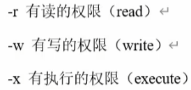

5. 文件类型判断：

    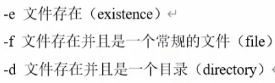

6. 重要例子：三目运算符`[ 命令1 ] && echo true || echo false`

7. 逻辑判断

    - `-a`表示与。`-o`表示或。例如：`[ $a -gt 18 -a $a -lt 35 ]`
    - `[ $a -gt 18 ] && [ $a -lt 35 ]`

### 2.4流程控制

1. `if`分支流程

    ```shell
    if [ 条件判断式 ]
    then
    	程序
    elif
    then
    	程序
    else
    	程序
    fi
    ```

2. `case`分支流程

    ```shell
    case 变量 in
    "值1")
    	程序1
    ;;
    "值2")
    	程序2
    ;;
    *)
    	否则程序3
    ;;
    esac
    ```

3. 循环控制

    - `for_1`

        ```shell
        for (( i=1; i <= $1; i++ ))
        do
                sum=$[ $sum + $i ]
        done
        ```

    - `for_2`

        ```shell
        for i in {1..100}
        do
        	sum=$[$sum+$i]
        done
        ```

    - `while`

        ```shell
        a=0
        while [ $a -le $1 ]
        do
                sum=$[ $sum + $a ]
                a=$[ 1 + $a ]
        done
        ```

### 2.5控制台读取数据

1. `read [选项：-p提示，-t等待时间] [参数]`

### 2.6函数

1. 系统函数：basename，dirname

2. 自定义函数：

    - 定义：`function 函数名(){}`
    - 调用：

3. 技巧

    - 返回值范围：整数的0~255。用以下方法替换

        ```shell
        function add(){
                sum=$[$1 + $2]
                echo $sum
        }
        
        read -p "请输入第一个整数：" a
        read -p "请输入第二个整数：" b
        sum=$(add $a $b)
        echo "和为："$sum
        ```
        

### 2.7综合应用

1. 自动归档文件

## 3.执行脚本

1. 方式一：`bash|sh 脚本路径`。在子`bash`中执行
2. 方式二：直接用路径执行，当前文件夹用`./文件`，但是要注意给文件执行的权限。在子`bash`中执行
3. 方式三：用`.`或者`source`替换方式一的`bash`。在当前`bash`执行。

## 4正则表达式：匹配符合要求的行

1. 基础表达式：
    - `^`表示行头
    - `$`表示行尾
    - `.`匹配一个任意字符
    - `*`匹配0或1或多个字符
    - `[]`范围匹配

## 5.文本工具

### 5.1`cut`

1. 语法：`cut [] filename`

    - `-f`提取的列号
    - `-d`分隔符，默认是`\t`
    - `-c`按照字符处理

2. 使用案例

    ```shell
    ifconfig | grep netmask | cut -d " " -f 10
    ```

### 5.2`awk`

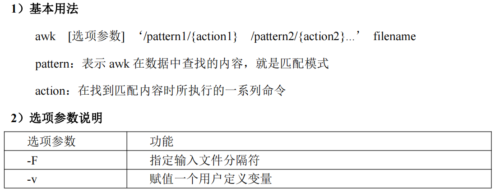

## 6.用户通信

1. 查询用户是否可以通信：`who +T`

2. 开启/关闭通信：`mesg y|n`

3. 发送消息：`write 用户 控制台`

4. 结束会话：`ctrl + c`

5. 例子：使用脚本发送消息`./send_msg.sh root hi,lff`

    ```shell
    #!/bin/bash
    # 查看用户是否登录
    login_user=$(who | grep -i -m 1 $1 |awk '{print $1}')
    
    if [ -z $login_user ]
    then
            echo "$1 不在线"
            echo "脚本退出。。。"
            exit
    fi
    
    # 查看用户是否开启会话
    is_allowed=$(who -T | grep -i -m 1 $1 |awk '{print $2}')
    
    if [ $is_allowed != "+" ]
    then
            echo "$1 没有开启消息功能"
            echo "脚本退出。。。"
            exit
    fi
    
    # 确认是否有消息发送
    if [ -z $2 ]
    then
            echo "没有消息发送"
            echo "脚本退出。。。"
            exit
    fi
    
    # 从参数中获取要发送的信息
    whole_msg=$(echo $* | cut -d " " -f 2-)
    
    # 获取用户登录的终端
    user_terminal=$(who | grep -i $1 |awk '/pts\/1/{print $2}')
    
    # 发送消息
    echo $whole_msg | write $login_user $user_terminal
    
    if [ $? = 0 ]
    then
            echo "消息发送成功"
    else
            echo "消息发送失败"
    fi
    exit
    ```

    
